<h2 align = center>MNIST Classification with Softmax and MLP</h2>
<h4 align = right> 计86 2018011438 周恩贤</h4>
### Softmax for MNIST Classification

本次作业我们需要利用 Softmax classifier 处理手写数字识别的任務。相关代码已补全


#### 问题与解决

其中在实现时遇到了两个问题。解决方式如下 : 

+ Tensor shape不匹配问题

  依照 Softmax 函数的定义 : $h_k(x) = \frac{exp(\theta^{(k)T}x)}{\Sigma_{j=1}^{K}{exp(\theta^{(j)T}x)}}$ , 自然可以写出以下代码 : 

```python
h = exp / exp.sum(axis = 1)
```

然而编译器报错 :  ```operands could not be broadcast together with shapes (100,10) (100,)```

代表着两个矩阵维数不同无法运算。此时改写并增维 , 即可通过编译。

```
 h = exp / exp.sum(axis = 1)[:, np.newaxis] 
```

 ( 参考资料 https://www.cnblogs.com/edhg/p/7685402.html )


+ 符号问题 : 一开始代码 **写错了** , 发现 loss 训练出来是负数 , 且与accuracy为正相关 :

  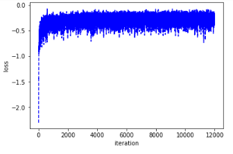

  考虑到误差不可能为负, 检查代码后发现**遗漏了交叉熵前面的负号**, 已改正。

  

#### 训练结果

一开始使用 $\eta = 0.05, \lambda = 0.5$ , 发现准确率仅达 **0.8** , 并不是很鲁棒 , 我们从两个方式调整超参数


+ 固定 $batch\_size = 100 ,\;  max\_epoch = 20,\;  \eta = 0.05$ 时, 改变$\lambda$

  | $\lambda$ |  0.5   |  0.3   |  0.1   |  0.01  | 0.001  |   0.0001   | 0.00001 |   0    |
  | :-------: | :----: | :----: | :----: | :----: | :----: | :--------: | :-----: | :----: |
  | accuracy  | 0.7999 | 0.8429 | 0.8674 | 0.9047 | 0.9182 | **0.9211** | 0.9203  | 0.9201 |

+ 固定 $batch\_size = 100,\; max\_epoch = 20,\; \lambda =10^{-4} $ 时, 改变$\eta$

  |  $\eta$  |  1.0   |  0.5   |  0.3   |    0.2     |    0.1     |  0.05  |  0.01  | 0.001  |
  | :------: | :----: | :----: | :----: | :--------: | :--------: | :----: | :----: | :----: |
  | accuracy | 0.8974 | 0.9222 | 0.9221 | **0.9224** | **0.9225** | 0.9211 | 0.9101 | 0.8749 |


综上 , 考虑 $\lambda = 10^{-4},\; \eta = 0.15$  时 , softmax classifier 达到一个较优秀的测试结果 : $accuracy = 92.33 \%$ 。

训练过程如下图 : 

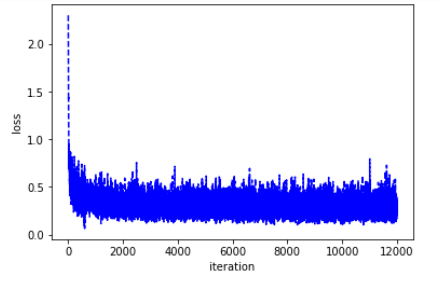      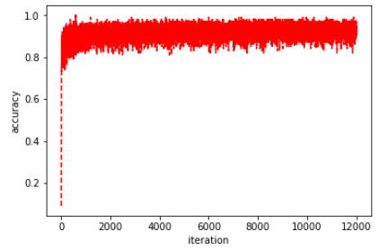


###  MLP for MNIST Clssification

本次作业我们需要利用 MLP 处理手写数字识别。相关代码已补全。

 

#### 问题与解决

在实现时遇到的问题 : 一开始在训练时 , 写出了以下代码, 发现 loss 固定 , 随机梯度下降法失效

```python
diff_W = -1 * self.learningRate * (layer.grad_W + self.weightDecay * layer.W)
```


后来才发现此写法 **diff_W 为函数中的临时变量, 没有被储存下来 , 故不会进行权值更新**

将 ```diff_W``` 修正为 ```layer.diff_W```


#### 模型架构 -- 单隐藏层模型

在单隐藏层模型中, 我们分别使用 sigmoid、ReLU 两种不同的激活函数搭配 EuclideanLoss、SoftmaxCrossEntropyLoss 两种不同损失函数对模型的影响。模型的架构以及相关超参数如下 :

|        Layer Type        | Input dim. | Output dim. |
| :----------------------: | :--------: | :---------: |
|         FCLayer          |    784     |     128     |
| SigmoidLayer / ReLULayer |    128     |     128     |
|         FCLayer          |    128     |     10      |

+ Learning rate : $\eta = 0.15$

+ Weight decay : $\lambda = 10^{-4}$

  

#### 训练结果 -- 单隐藏层模型

 ( 备注 : 取最后一个 $epoch$ 的平均值作为训练结果 )

|         Types of Model         | Training Loss | Training accuracy | Validation Loss | Validation Accuracy | Testing Accuracy |
| :----------------------------: | :-----------: | :---------------: | :-------------: | :-----------------: | :--------------: |
|    1.1 Sigmoid + Euclidean     |    0.0915     |      0.9074       |     0.0761      |       0.9284        |      0.9112      |
|      1.2 ReLU + Euclidean      |    0.0547     |      0.9635       |     0.0534      |       0.9674        |      0.9563      |
| 2.1Sigmoid+SoftmaxCrossEntropy |    0.1376     |      0.9615       |     0.1218      |       0.9682        |      0.9599      |
| 2.2 ReLU + SoftmaxCrossEntropy |    0.0242     |      0.9954       |     0.0735      |       0.9806        |    **0.9779**    |

##### Training by Euclidean Loss

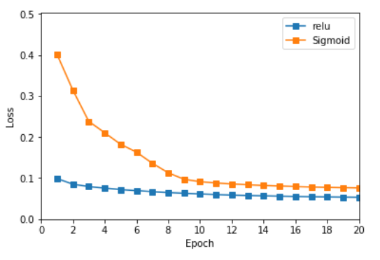 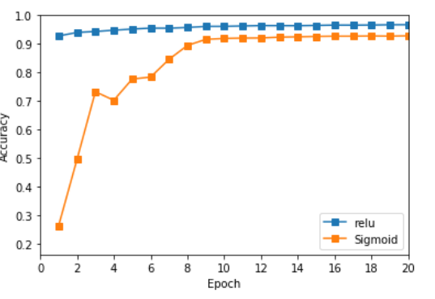

##### Training by SoftmaxCrossEntropy Loss

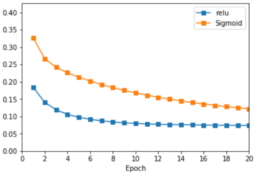 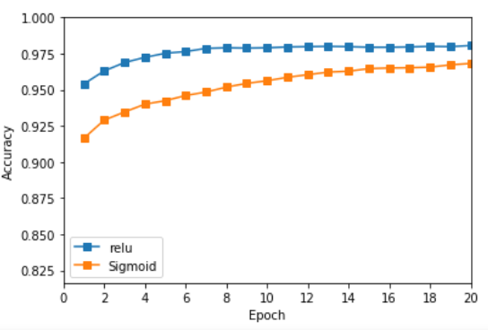


#### *优化 : momentum method

参考讲义公式 : $v = \gamma v-\eta \nabla_{\theta}J(\theta; x^{(i)}, t^{(i)})$ , 我们可在 diff 中加入动量修正项 : ```momentum * diff ```

##### 训练结果 (使用动量法优化后)

使用 $\gamma = 0.5$ 进行训练

|         Types of Model         | Training Loss | Training accuracy | Validation Loss | Validation Accuracy | Testing Accuracy |
| :----------------------------: | :-----------: | :---------------: | :-------------: | :-----------------: | :--------------: |
|    1.1 Sigmoid + Euclidean     |    0.0971     |      0.8992       |     0.0790      |       0.9248        |      0.9061      |
|      1.2 ReLU + Euclidean      |    0.0584     |      0.9573       |     0.0580      |       0.9612        |      0.9533      |
| 2.1Sigmoid+SoftmaxCrossEntropy |    0.0810     |      0.9783       |     0.0881      |       0.9768        |    **0.9693**    |
|  2.2 ReLU+SoftmaxCrossEntropy  |    0.0083     |      0.9995       |     0.0742      |       0.9818        |    **0.9788**    |

##### Training with momentum by Euclidean Loss

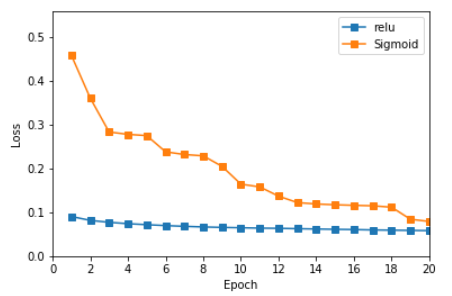 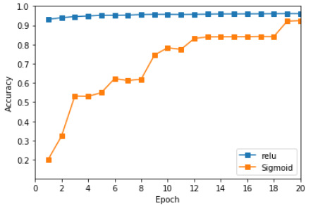

##### Training with momentum by SoftmaxCrossEntropy Loss

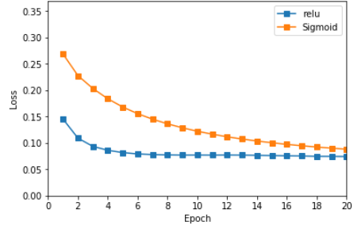 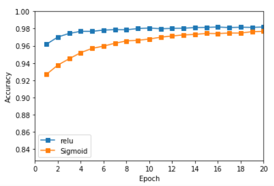


#### 模型架构 -- 双隐藏层模型

在双隐藏层模型中, 我们使用 ReLU 激活函数 搭配 SoftmaxCrossEntropyLoss。

模型的架构以及相关超参数如下 :

| Layer Type | Input dim. | Output dim. |
| :--------: | :--------: | :---------: |
|  FCLayer   |    784     |     256     |
| ReLULayer  |    256     |     256     |
|  FCLayer   |    256     |     128     |
| ReLULayer  |    128     |     128     |
|  FCLayer   |    128     |     10      |

- Learning rate : $\eta = 0.15$

- Weight decay : $\lambda = 10^{-4}$

  

#### 训练结果 -- 双隐藏层模型 (对比单层)

（备注：同样以 **ReLU 激活函数 + Softmax Cross Entropy 损失函数** 模型进行比对）

| Types of Model | Training Loss | Training accuracy | Validation Loss | Validation Accuracy | Testing Accuracy |
| :------------: | :-----------: | :---------------: | :-------------: | :-----------------: | :--------------: |
|   One Layer    |    0.0242     |      0.9954       |     0.0735      |       0.9806        |      0.9779      |
|   Two Layer    |    0.0028     |    **1.0000**     |     0.0779      |       0.9818        |    **0.9799**    |

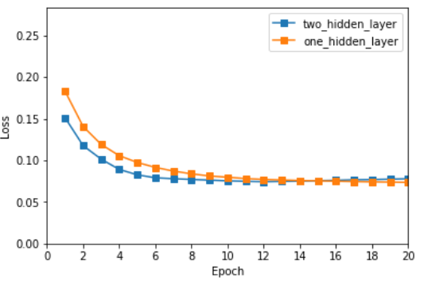        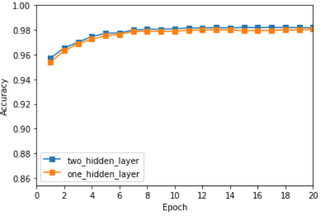


#### 总结

+ 超参数 : 依照 Softmax Classifier的经验 , 我选定 $\eta = 0.15,\; \lambda=10^{-4}$ , 效果不错 

+ 激活函数 : **ReLU 比 Sigmoid 效果更好**。收敛得更快、训练结果更准确。

+ 损失函数 :  **Softmax Cross Entropy Loss 比 Euclidean Loss 训练稍慢，但效果更好** 

+ 最佳搭配：**ReLU + Softmax Cross Entropy Loss**

+ 动量法 : 搭配 **Softmax Cross Entropy 时表现稍好** , 但搭配 Euclidean Loss 时反而表现较差

+ 双层隐藏层比单层隐藏层 : 收敛稍快 , 效果好一点点 （无明显区别）

  

##### 更新 : 作业得分与反馈 

10/10. There is no weight decay on bias $b$ , Fixed.