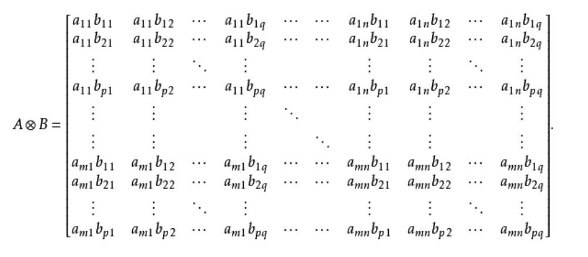
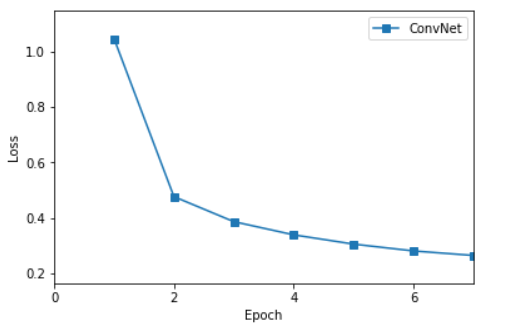
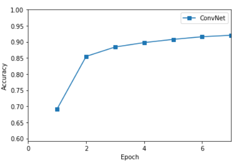

<h2 align = center>ConvNet for MNIST Classification</h2>
<h4 align = right> 计86 2018011438 周恩贤</h4>
本次作业我们需要利用 ConvNet (卷积神经网络) 处理手写数字识别的任務, 使用了第一次作业完成的 $fc\_layer,\; relu\_layer$ 等代码 , 其他相关代码已补全


#### 问题解决与小技巧

其中在实现时遇到了一些问题。解决方式如下 : 

+ Conv 层中 Tensor shape 匹配问题

  之前在实现作业1的时后以经遇到过了 , 透过 ```np.newaxis``` 增维, 注意到list的切片写法 **(逗号位置容易错)**

+ MaxPool 的backward层更技巧性的写法 : Kronecker积

  原本我采取用 for回圈 判断是否为最大值, 但是效率太差了, 后来询问同学并发现了改善的小技巧。

  首先 , 假设 ```kernel_size = k``` , 那我们可以依次对每 k 行 k 列提取出最大值 , 形成 $(w/k) \times (h/k) $ 的子图

  ```python
  tmp = np.full((n, c_in, h_out, w_pad), -1000000)
  for i in range(self.kernel_size):
      tmp = np.maximum(tmp, input_after_pad[:, :, i:h_pad:self.kernel_size, :])
  
  output = np.full((n, c_in, h_out, w_out), -1000000)
      for i in range(self.kernel_size):
          output = np.maximum(output, tmp[:, :, :, i:w_pad:self.kernel_size])
  ```
  
  这样就完成了maxpool。此时我们可以利用  Kronecker积  为计算反向传播的梯度做准备。
  
  Kronecker积可将 $A \in M_{m \times n}, B \in M_{p\times q}$ 的两矩阵扩充为 $mp \times nq$ 维的矩阵。运算性质如下 :
  
  
  
  因此 , 我们将maxpool提取出的矩阵与全部都是1的 $k\times k$  矩阵做Kronecker积, 会得到一个跟原图同样大小为$w \times h$ 的矩阵 , **但是每个k阶子方块都是同样的值, 也就是其中最大的代表值**。此时将这个矩阵与原本的矩阵相比判等 (因为float的计算可能会有误差, 故用 $\geq$ 号), **相等元素的位置就是1, 其他就是0 ;**   计算梯度时再将delta扩大成原图尺寸, 与该矩阵对应元素位置相乘即可！（最后, 每个k阶子矩阵最大的地方会是delta , 其他都是0 )
  
  

#### 模型架构 

| Layer Type |         Input dim.         |        Output dim.         |   Kernel   | Pad  |
| :--------: | :------------------------: | :------------------------: | :--------: | :--: |
|    Conv    |  $1 \times 28 \times 28 $  |  $8 \times 28 \times 28 $  | $3\times3$ | $1$  |
|    ReLU    |  $8 \times 28 \times 28 $  |  $8 \times 28 \times 28 $  |            |      |
|  MaxPool   |  $8 \times 28 \times 28 $  |  $8 \times 14 \times 14 $  | $2\times2$ | $0$  |
|    Conv    |  $8 \times 14 \times 14 $  | $16 \times 14 \times 14 $  | $3\times3$ | $1$  |
|    ReLU    | $ 16 \times 14 \times 14 $ | $ 16 \times 14 \times 14 $ |            |      |
|  MaxPool   | $ 16 \times 14 \times 14 $ |  $ 16 \times 7 \times 7 $  | $2\times2$ | $0$  |
|  ReShape   |  $ 16 \times 7 \times 7 $  |           $784$            |            |      |
|  FCLayer   |           $784$            |           $128$            |            |      |
|    ReLu    |           $128$            |           $128$            |            |      |
|  FCLayer   |           $128$            |            $10$            |            |      |


#### 部份训练结果与作图

没有改变超参数 ,  $batch\_size = 100,\; max\_epoch = 10,\; init\_std=0.1,\; \lambda =0.005,\; \eta = 0.001 $

由于在训练过程中不小心与服务器断开连接 , **只训练完成了7个$epoch$**, 训练输出信息在 $train.txt$

| Epoch | Training Loss | Training accuracy | Validation Loss | Validation accuracy |
| :---: | :-----------: | :---------------: | :-------------: | :-----------------: |
|   1   |    1.0460     |      0.6920       |     0.5415      |       0.8390        |
|   2   |    0.4764     |      0.8549       |     0.4185      |       0.8742        |
|   3   |    0.3862     |      0.8840       |     0.3425      |       0.8962        |
|   4   |    0.3386     |      0.8977       |     0.3298      |       0.9028        |
|   5   |    0.3052     |      0.9077       |     0.2779      |       0.9188        |
|   6   |    0.2806     |      0.9159       |     0.2608      |       0.9230        |
|   7   |    0.2643     |      0.9205       |     0.2459      |     **0.9264**      |

此七轮训练的 $loss$ 与 $accuracy$ 的作图如下 :

( 由于已经与服务器断开连接,  只剩下输出信息, 我手动将训练结果用列表记录并作图 )







#### 改变超参数后的测试结果

由于时间缘故 , 我只改变了 **learning_rate** , 且将**epoch 减低为2** , 结果有可能不够鲁棒

- 固定 $batch\_size = 100,\; max\_epoch = 2,\; init\_std=0.1,\; \lambda =0.005 $ 时, 改变$\eta$

  |    $\eta$     | 0.001  |  0.01  |    0.03    |  0.1   |  0.15  |  0.3   |
  | :-----------: | :----: | :----: | :--------: | :----: | :----: | :----: |
  | test accuracy | 0.8827 | 0.9516 | **0.9777** | 0.9100 | 0.9520 | 0.1704 |

 $\eta = 0.03$  时 ,  ConvNet 达到一个较优秀的测试结果 : $accuracy = 97.77 \%$


#### 总结

- 超参数 : 一开始 $\eta = 0.001$ 时效果不佳 , 改成 $\eta = 0.03$  时效果似乎最好 

- ConvNet **训练时间相对较长, 收练速度慢, 训练结果与MLP差不多** 。

- 单纯以训练时间与最终结果来比较的话, 在手写数字识别的任务上, ConvNet 的效率比 MLP 差。

  ( 也有可能是因为**训练不够完全** , 等下次作业用 pytorch 利用GPU加速并完整训练后再进一步确认 )

  


#### 心得与可改善之处

+ 这次用numpy实现CNN的过程 , 让我深知 **不能拖ddl** 的重要性... 因为没有使用 im2col , 完整训练10个epoch 需要大概花费五个小时的时间... 然而我开始训练的时间已经是晚上七点半了, 中间还发生了意外 (与服务器断开连接) ...也因此模型没有训练的很完全, 下次绝对会早点开始做 !
+ 本次作业的结论让我有一种 **割鸡焉用牛刀** 的感觉 : 在上次的作业中, MLP模型训练时间短、收敛速度快 (尤其 ReLU激活函数 + SoftmaxCrossEntropy 损失函数的单层MLP模型, 仅需几分钟就能训练出准确率达 97 % 的网络了) ; 反而ConvNet 在错误的学习率下, 训练了两个小时都还训练不好 ...... 。 但我相信, **在更困难的任务 , 例如图像处理、特征提取等任务上CNN一定能大展伸手的 !**
+ 可改善之处非常多, 例如:
  + 尝试学习 im2col , 加快训练速度
  + 尝试不同 $\eta $ 和 $\lambda$ 的排列组合 , **且完整训练完 10 个 epoch**
  + 改变网络结构, **尝试不同pad 、kernel_size 对训练结果的影响**
  + 尝试可视化
  + 使用ConvNet 处理更困难复杂的问题


##### Acknowledgement

感谢计86班陈博涵同学教导我 Kronecker积 的用法