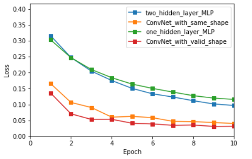
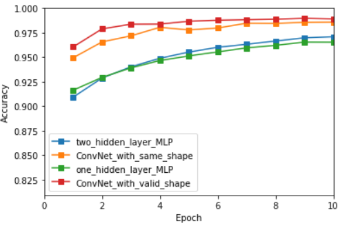

<h2 align = center>MNIST Classification with PyTorch</h2>
<h4 align = right> 计86 2018011438 周恩贤</h4>
本次作业我们利用 pytorch 实现MLP以及ConvNet 来处理手写数字识别的任务。相关代码写于 ```MNIST.py``` 中

过程中, 我参考了网上示例程序 : https://github.com/pytorch/examples/blob/master/mnist/main.py 


#### 问题与解决

+ Convolve 后的 shape 改变了 ?

  原因在于, pytorch 默认使用 **valid 卷积模式 , 没有padding**。 如果要和第二次作业一样使用 **same** 卷积的话, 只需要在 ```Conv2d``` 的**第五个参数传入正确的 padding 大小即可**

+ 绘图的困扰 ?

  原本想说在终端中调用 ```matplotlib``` , 发现到环境不支持绘图。我的解决方法是将测试结果的 ```loss``` 和 ```acc```复制下来 , 黏贴到 ```jupyter notebook``` 中绘制。 绘图代码即是作业一的 ```plot.py``` , 绘图结果在 ```plot.ipynb```

  

#### 运行指令

安装好 ```pytorch``` 并在命令行中输入 ```python MNIST.py [--argv]``` 即可。 可传入的命令行参数如下 :

+ ```--batch-size  %d ``` , 表示每次训练所使用的 batch_size , 预设为100
+ ```--test-batch-size  %d```  ,  表示每次测试所使用的 batch_size , 预设为100
+ ```--epoch %d```  , 表示训练的轮数 , 预设为 10
+ ```--lr %f``` , 表示 learning rate $\eta$ , 预设为 0.01
+ ```--momentum %f``` 表示使用动量法的系数 $\gamma$ , 预设为 0.5
+ ```--weight_decay %f``` 表示 weight_decay $\lambda$ , 预设为0
+ ```--no-cuda bool``` 表示是否不使用GPU , 预设为 False
+ ```--seed %d``` 表示随机数的种子 , 预设为1
+ ```--log-interval %d``` 表示训练多少个 batches 后输出训练信息 , 预设为60

例如 , 在命令行中输入 ```python MNIST.py --epoch 1 --lr 0.15``` , 代表用$\eta = 0.15$ 的超参数 (其他用预设值) 进行训练 , 且每个模型只会被训练一轮。 


#### 模型架构 

实现了四个模型 : **单隐藏层MLP、双隐藏层MLP、same卷积网络 (Conv1) 、valid卷积网络 (Conv2) **

损失函数采用 ```CrossEntropyLoss()```  ( 等价于参考教程中, 用 ```log_softmax``` 激活函数 + ```NLL```损失函数 )

##### MLP1 : 单隐藏层

| Layer Type | Input dim. | Output dim. |
| :--------: | :--------: | :---------: |
|  FCLayer   |    784     |     128     |
| SReLULayer |    128     |     128     |
|  FCLayer   |    128     |     10      |

#####MLP2 : 双隐藏层MLP

| Layer Type | Input dim. | Output dim. |
| :--------: | :--------: | :---------: |
|  FCLayer   |    784     |     256     |
| ReLULayer  |    256     |     256     |
|  FCLayer   |    256     |     128     |
| ReLULayer  |    128     |     128     |
|  FCLayer   |    128     |     10      |

##### Conv1 : Same卷积, stride = 1x1

(卷积以及池化层的维数表示 ```channel, width, height```)

| Layer Type |         Input dim.         |        Output dim.         |   Kernel   |    Pad     |
| :--------: | :------------------------: | :------------------------: | :--------: | :--------: |
|    Conv    |  $1 \times 28 \times 28 $  |  $8 \times 28 \times 28 $  | $3\times3$ | $1\times1$ |
|    ReLU    |  $8 \times 28 \times 28 $  |  $8 \times 28 \times 28 $  |            |            |
|  MaxPool   |  $8 \times 28 \times 28 $  |  $8 \times 14 \times 14 $  | $2\times2$ |    $0$     |
|    Conv    |  $8 \times 14 \times 14 $  | $16 \times 14 \times 14 $  | $3\times3$ | $1\times1$ |
|    ReLU    | $ 16 \times 14 \times 14 $ | $ 16 \times 14 \times 14 $ |            |            |
|  MaxPool   | $ 16 \times 14 \times 14 $ |  $ 16 \times 7 \times 7 $  | $2\times2$ |    $0$     |
|  ReShape   |  $ 16 \times 7 \times 7 $  |           $784$            |            |            |
|  FCLayer   |           $784$            |           $128$            |            |            |
|    ReLu    |           $128$            |           $128$            |            |            |
|  FCLayer   |           $128$            |            $10$            |            |            |

##### Conv2 : Valid卷积 , stride = 1x1 

| Layer Type |        Input dim.         |        Output dim.        |   Kernel   | Pad  |
| :--------: | :-----------------------: | :-----------------------: | :--------: | :--: |
|    Conv    | $1 \times 28 \times 28 $  | $20 \times 24 \times 24 $ | $5\times5$ | $0$  |
|    ReLU    | $20 \times 24 \times 24 $ | $20 \times 24 \times 24 $ |            |      |
|  MaxPool   | $20 \times 24 \times 24 $ | $20 \times 12 \times 12 $ | $2\times2$ | $0$  |
|    Conv    | $20 \times 12 \times 12 $ |  $50 \times 8 \times 8 $  | $5\times5$ | $0$  |
|    ReLU    |  $50 \times 8 \times 8 $  |  $50 \times 8 \times 8 $  |            |      |
|  MaxPool   |  $50 \times 8 \times 8 $  |  $50 \times 4 \times 4 $  | $2\times2$ | $0$  |
|  ReShape   | $50 \times  4 \times 4 $  |           $784$           |            |      |
|  FCLayer   |           $784$           |           $128$           |            |      |
|    ReLu    |           $128$           |           $128$           |            |      |
|  FCLayer   |           $128$           |           $10$            |            |      |

### 

#### 不同模型的结果

超参数为预设值 :   $\eta = 0.01,\; \lambda = 0,\; \gamma = 0.5,\; epoch = 10,\; batch\_size = 100 $

训练结果已经记载在 ```/log/default.txt``` 中 , 测试```accuracy```结果如下 :

| Epoch |  MLP1  |  MLP2  | Conv1  |   Conv2    |
| :---: | :----: | :----: | :----: | :--------: |
|  #1   | 0.9163 | 0.9092 | 0.9494 |   0.9605   |
|  #2   | 0.9294 | 0.9287 | 0.9656 |   0.9789   |
|  #3   | 0.9391 | 0.9402 | 0.9718 |   0.9837   |
|  #4   | 0.9466 | 0.9489 | 0.9805 |   0.9838   |
|  #5   | 0.9513 | 0.9552 | 0.9778 |   0.9867   |
|  #6   | 0.9554 | 0.9601 | 0.9798 |   0.9877   |
|  #7   | 0.9595 | 0.9632 | 0.9847 |   0.9883   |
|  #8   | 0.9621 | 0.9665 | 0.9845 |   0.9888   |
|  #9   | 0.9654 | 0.9698 | 0.9856 |   0.9897   |
|  #10  | 0.9653 | 0.9709 | 0.9858 | **0.9891** |

图形绘制如下 :





小结 : **CNN表现比MLP好** , 双隐藏层稍优于单隐藏层模型 ;  valid卷积 (且输出channel数提高时) 比 same卷积更好

 

#### 改变 learning rate 

固定其他超参数 :   $\lambda = 0,\; \gamma = 0.5,\; epoch = 10,\; batch\_size = 100 $

训练结果已经记载在 ```/log/lr=xxx.txt``` 中  , 最后一个 epoch 测试```accuracy```结果如下 :

|  lr  |    MLP1    |    MLP2    |   Conv1    |   Conv2    |
| :--: | :--------: | :--------: | :--------: | :--------: |
| 0.01 |   0.9653   |   0.9709   |   0.9858   |   0.9891   |
| 0.10 |   0.9805   | **0.9829** | **0.9896** | **0.9925** |
| 0.15 | **0.9810** |   0.9819   |   0.9864   |   0.9915   |
| 0.30 |   0.9769   |   0.9804   |   0.9837   |   0.9839   |

小结 : $\eta = 0.10 \sim 0.15$  时表现最优,  与第一次作业的结论相符。


#### 改变 weight decay

固定其他超参数 :   $ \eta = 0.1,\; epoch = 10,\; batch\_size = 100 $

部份训练结果已经记载在 ```/log/wd=xxx.txt``` 中  , 最后一个 epoch 测试```accuracy```结果如下 :

| wd     | MLP1       | MLP2       | Conv1      | Conv2      |
| ------ | ---------- | ---------- | ---------- | ---------- |
| 0.01   | 0.9642     | 0.9647     | 0.9785     | 0.9815     |
| 0.001  | **0.9798** | 0.9826     | 0.9895     | 0.9897     |
| 0.0001 | 0.9797     | **0.9832** | **0.9904** | **0.9912** |

小结 : $\lambda = 0.0001$  时表现最优,  与第一次作业的结论相符。


#### 心得与总结

+ 超参数的结论和第一次作业的结论大致相同

+ **收回第二次作业对CNN的质疑** !  主要第二次因为时间问题 , 没有训练完整 , 有一种 CNN 比MLP差的错觉。 直到这次作业才发现其实在GPU上面跑两者速度几乎没差别 , 且 CNN 整体表现比 MLP 好

+ 这次作业让我深深体会到服务器的强大 , **GPU加速**太牛逼了 ... (同样是ConvNet, 第二次作业训了一个晚上只训练了7个完整的epoch , 而这次几乎是一分钟一个epoch...) 。因此报告也相对完整地多

+ 希望之后有机会能尝试上课提到的优化方法 : 如 dropout、batch_normalization

  
