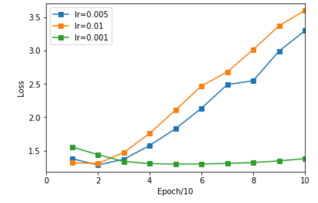
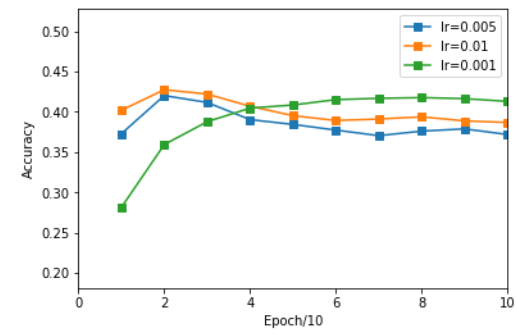
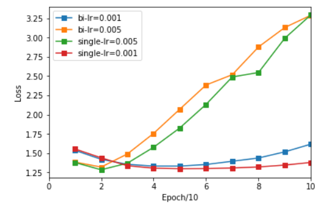
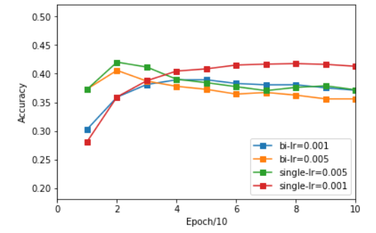

<h2 align = center>Sentence-level Sentiment Classification with PyTorch</h2>
<h4 align = right> 计86 2018011438 周恩贤</h4>
本次作业我们利用 pytorch 实现 RNN 来处理情感分析的任务。

模型写于 ```RNN.py``` 中 , 运行写于 ```main.py​```

#### 运行环境

使用百度云 ```AI Studio``` 服务器

```
GPU: Tesla V100. Video Mem: 16GB
CPU: 8cores, RAM:32GB, Disk:100GB
```


#### 问题与解决

- 运行速度慢 ?

  才发现从第三次作业开始就忘了使用GPU... 记得要加$.cuda()$、$to(device)$ 指令使用。

-  绘图的困扰 ?

  原本想说在终端中调用 ```matplotlib``` , 发现到环境不支持绘图。我的解决方法是将测试结果的 ```loss``` 和 ```acc```复制下来 , 黏贴到 ```jupyter notebook``` 中绘制。 绘图代码即是作业一的 ```plot.py``` , 绘图结果在 ```plot.ipynb```

  

#### 运行指令

安装好 ```pytorch``` 并在命令行中输入 ```python main.py [--argv]``` 即可。 可传入的命令行参数如下 :

- ```--batch-size  %d ``` , 表示每次训练所使用的 $batch\_size$ , 预设为128
- ```--epoch %d```  , 表示训练的轮数 , 预设为 100
- ```--lr %f``` , 表示 learning rate $\eta$ , 预设为 0.005
- ```--momentum %f``` 表示使用动量法的系数 $\gamma$ , 预设为 0.9
- ```--weight_decay %f``` 表示 weight_decay $\lambda$ , 预设为$1e-5$
- ```--no-cuda bool``` 表示是否不使用GPU , 预设为 False
- ```--seed %d``` 表示随机数的种子 , 预设为1
- ```--log-interval %d``` 表示训练多少个 batches 后输出训练信息 , 预设为10

例如 , 在命令行中输入 ```python main.py --epoch 200 --lr 0.15``` , 代表用$\eta = 0.15$ 的超参数 (其他用预设值) 进行训练 , 且每个模型会被训练200轮。 


#### 模型架构 

实现了**带dropout、attention的单向/双向LSTM网络** , 损失函数采用 ```CrossEntropyLoss()``` , 示意图如下 :


$Attention Layer$的宽度即为$label$的种类 , 本次作业中为5

$dropout$ 的值预设0.5


#### 不同Learning Rate的结果

模型使用单向LSTM。改变$\eta$, 固定其他超参数 :   $\; \lambda = 1e-5,\; \gamma = 0.5,\; epoch = 100,\; batch\_size = 128 $

详细日志结果记载在 ```/log/single-lr=xxx``` 中。

每10个epoch的测试```accuracy```以及观测结果记录如下：

| Epoch |    lr=0.01    |   lr=0.001    |   lr=0.005    |
| :---: | :-----------: | :-----------: | :-----------: |
|  #10  | **42.9253 %** |   33.5069 %   |   41.667 %    |
|  #20  |   42.2309 %   |   37.7604 %   | **41.9705 %** |
|  #30  |   41.4931 %   |   39.5399 %   |   40.4948 %   |
|  #40  |   40.1910 %   |   40.7986 %   |   40.1042 %   |
|  #50  |   39.2361 %   |   41.1458 %   |   38.5851 %   |
|  #60  |   38.2812 %   |   41.5799 %   |   36.2381 %   |
|  #70  |   39.3663 %   |   41.9705 %   |   38.1510 %   |
|  #80  |   39.5833 %   | **41.9271 %** |   37.4566 %   |
|  #90  |   38.4549 %   |   41.0590 %   |   37.3264 %   |
| #100  |   39.0191 %   |   41.4062 %   |   37.5434 %   |
| 备注  | 约#10时过拟合 | 约#75时过拟合 | 约#15时过拟合 |

取每10个epoch的平均值, Loss 与 Acc作图如下 :





小结 :  取 $\eta = 0.001$ 时训练比较不容易过拟合, 有大约 **41%** 的准确度

 

#### 单/双向的影响

同样改变Learning rate, 但此时使用双向LSTM网络。

固定其他超参数 :   $\; \lambda = 1e-5,\; \gamma = 0.5,\; epoch = 100,\; batch\_size = 128 $

详细日志结果记载在 ```/log/bi-lr=xxx``` 中

取每10个epoch的平均值, 并与单向LSTM的值作对比, Loss 与 Acc作图如下 :





小结 :  双向LSTM比单向LSTM的效果还差且更容易过拟合, 推测因为 **数据集太小**


#### 心得与总结

- 本次尝试了许多优化方法 : $attention + LSTM + dropout$ , 最高达到了 **43%** 的准确度

- 取 $\eta = 0.001$ 时训练稳定, 大致收敛于 **41%** 的 $Acc$

- 双向LSTM比单向LSTM的效果还要差 ? 个人的推测可能是因为数据集太小, 也有可能是因为 **分类任务不太适合用双向 LSTM** (或许在翻译、生成字词等任务更适合双向 LSTM )

  
